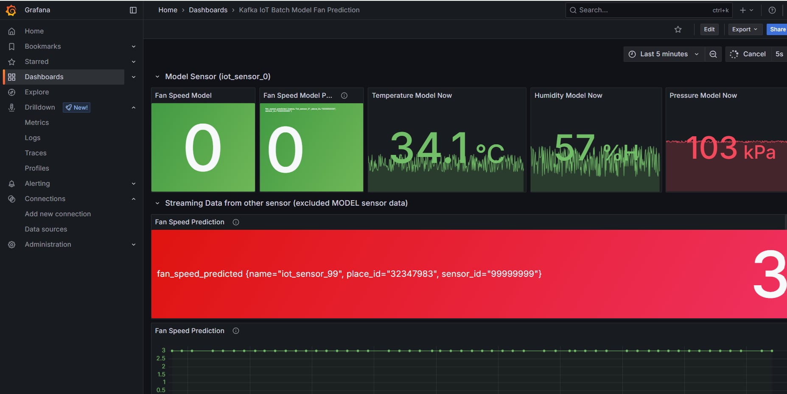

# Online Prediction

<!-- Online Prection ทำงานอย่างไร  -->

## ปิดการใช้งานของ Batch ML ดังนี้

1. Kafka-to-json
2. Train-from-data
3. Predicted-then-infuxdb

## เริ่มใช้งาน Online ML ดังนี้

1. docker compose down batch ml
2. แก้ .env
3. docker compose up online ml

## ผลที่ได้จากการใช้ ML มีดังนี้

